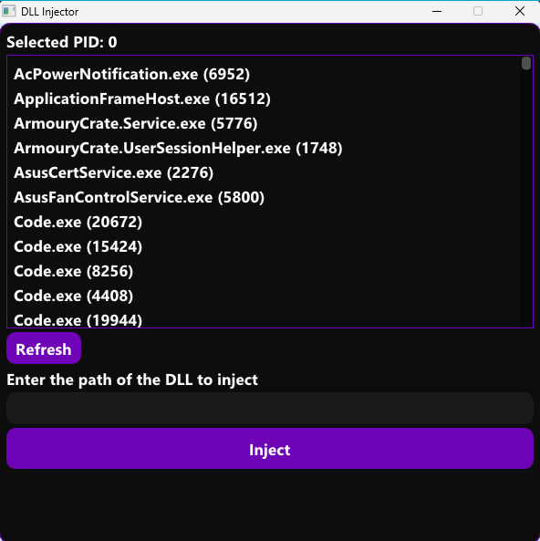

# 🚀 Win64 DLL Injector

##  Preview



---

## 🧠 Overview

Win32 DLL Injector is a lightweight Windows tool that allows controlled injection of a DLL into a running process.

It features a modern GUI built with Dear ImGui + DirectX 11 and demonstrates low-level Windows internals such as process manipulation and remote code execution.

👉 Designed for **learning, debugging, and system-level experimentation**.

---

## ✨ Key Features

* 🔍 Process enumeration (ToolHelp API)
* 🖥️ Clean GUI with Dear ImGui
* ⚡ DirectX 11 rendering
* 💉 DLL injection (CreateRemoteThread + LoadLibrary)
* 🔄 Real-time process refresh
* 🎯 Simple workflow (select → input → inject)

---

## 🧰 Tech Stack

* 💻 C++
* 🪟 Win32 API
* 🎮 DirectX 11
* 🎨 Dear ImGui
* 🛠️ Makefile build system (no Visual Studio required)

---

## ⚙️ How It Works

### 1. 🔍 Process Enumeration

* `CreateToolhelp32Snapshot`
* `Process32First` / `Process32Next`
* Sorted and displayed in GUI

### 2. 🖥️ GUI

* Process list with PID
* DLL path input
* Inject button
* Refresh button

### 3. 💉 Injection Flow

1. `OpenProcess`
2. `VirtualAllocEx`
3. `WriteProcessMemory`
4. `CreateRemoteThread` → `LoadLibraryA`

---

## 📁 Project Structure

```
.
├── bin/                # Compiled binaries (.exe / .dll)
├── includes/           # Headers
├── src/
│   ├── dll/            # Example injected DLL
│   ├── gui/            # UI logic
│   ├── injector/       # Injection logic
│   └── target/         # Test target process
├── imgui/              # Dear ImGui sources
├── Makefile
└── README.md
```

---

## 🛠️ Build & Run

### ✅ Requirements

* Windows 10/11
* MinGW / GCC
* `make`

### ▶️ Build

```
make
```

### ▶️ Run

```
./bin/dll_injector.exe
```

---

## 🧹 Makefile Targets

```
make        # build everything
make clean  # remove object files
make fclean # remove binaries
make re     # full rebuild
```

---

## 🧪 Example Payload

Included DLL:

* 📦 Shows a message box ("Injected!")
* 💀 Terminates the target process (for testing)

---

## ⚠️ Disclaimer

This project is for:

* 🎓 Educational purposes
* 🧪 Debugging & testing

❌ Do not use on software or systems without permission.

---

## 🧠 Skills Demonstrated

* Win32 API (process + threads)
* Memory manipulation
* DLL injection techniques
* GUI with ImGui
* Graphics pipeline (DirectX 11)
* Low-level debugging mindset

---

## 👤 Author

Zibgame

---

## 📜 License

MIT
